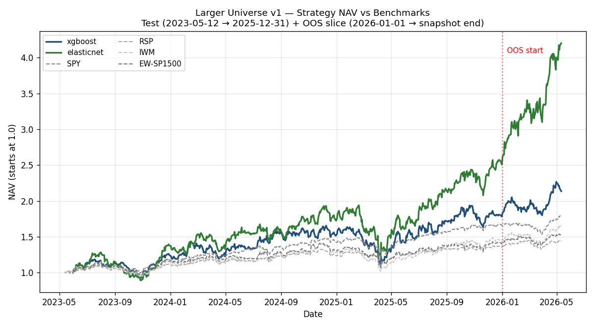
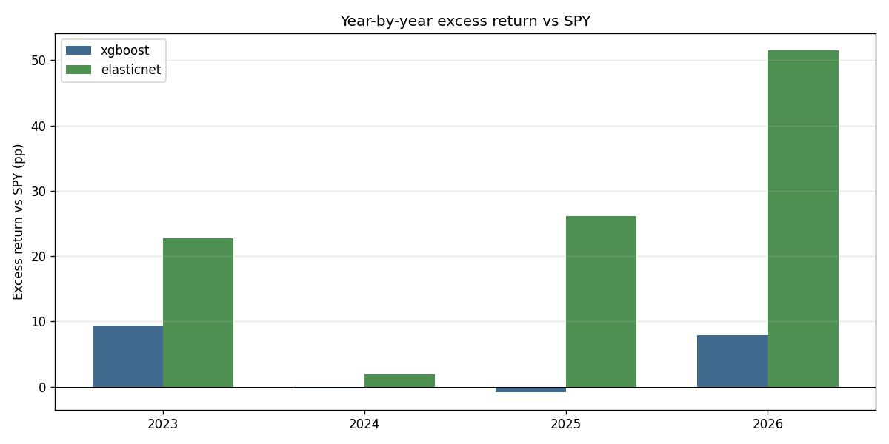
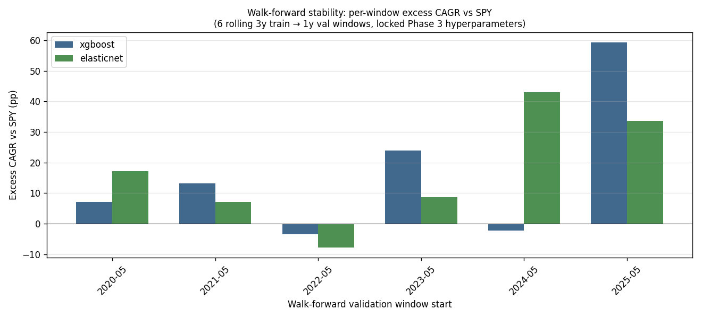
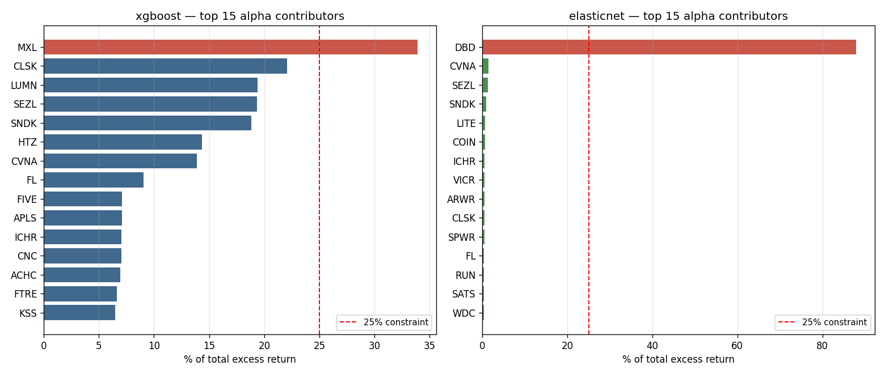
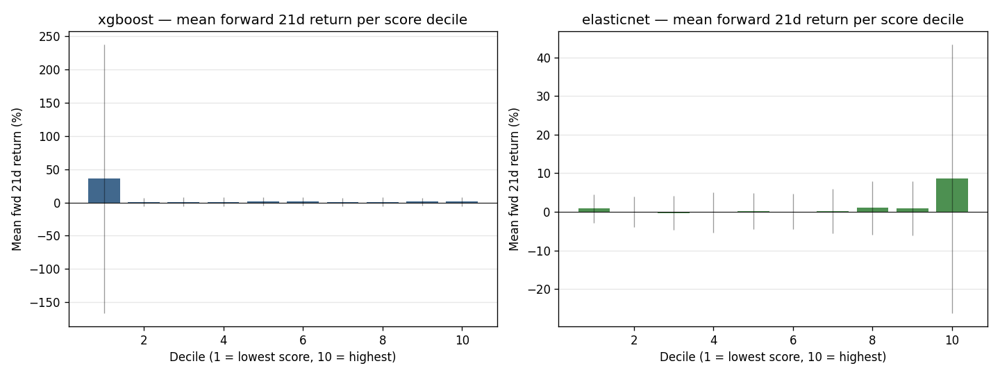
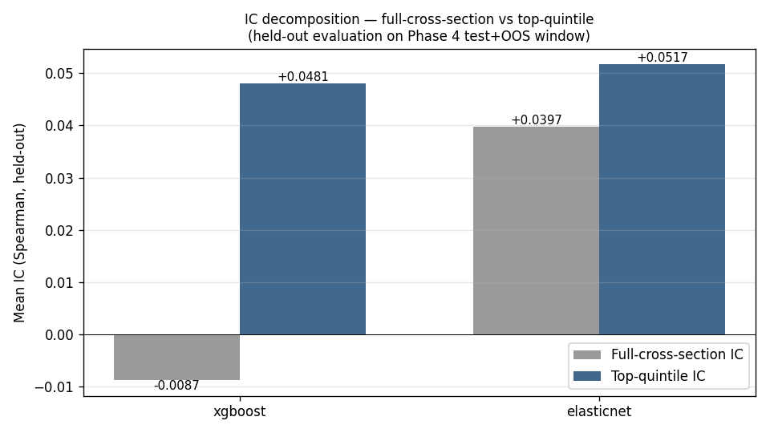

# Larger Universe v1 — Study results

**Branch:** `feat/larger-universe-v1-study`
**Snapshot:** `models/snapshots/equities/larger_universe_v1_20260511/`
**Spec:** `docs/studies/larger_universe_v1/spec.md` (revised 2026-05-11 post-horizon-diagnostic)
**Dashboard:** `/studies/larger_universe_v1` (contract-conformant, see `docs/architecture/dashboard_contract_v1.md`)
**Status:** Complete. **Not promoted** — see "Success criteria" below for the explicit rationale.

## Executive summary

- **Universe was successfully expanded** from the legacy 491-ticker survivorship-biased snapshot to 2,122 tickers (1,506 active SP500/400/600 + 616 historically-removed members) with documented survivorship-bias mitigation. Snapshot data infrastructure, fetch pipeline, and quality controls are reusable for all future equity studies.
- **Neither model met the full promotion criteria.** XGBoost (primary) earned +3.5pp excess CAGR vs SPY on the test window but failed both the 1.5×-SPY-drawdown constraint (−33.5% vs −28.5% threshold) and the no-single-ticker-> 25%-of-alpha constraint (MXL at 33.9%). ElasticNet (sanity check) showed +21.2pp excess CAGR but **88% of its alpha came from a single ticker (DBD)** — failed concentration severely.
- **Methodology finding 1: full-cross-section Spearman IC was the wrong CV objective for top-N strategies.** XGBoost's positive in-fold IC (+0.028) became negative held-out (−0.009), with the real signal living in the top quintile (+0.048). Architectural memo `ml_study_cv_objectives_v1.md` captures the dual-reporting pattern future studies must follow per the updated dashboard contract.
- **Methodology finding 2: feature/model/construction interaction drives concentration.** ElasticNet's 88%-DBD result is the deterministic consequence of trend features + linear model + light regularization + rank-top-N + monthly cadence. The DBD case study below derives the mechanism.
- **Dashboard contract v1 established.** First contract-conformant study with universal tabs in place; future studies inherit the infrastructure rather than each retrofitting the dashboard.

## What we set out to test

The three promoted studies (#325 regime-dependent, #842 15-position, #1852 continuous-sizing) were built on a legacy 491-ticker survivorship-biased snapshot. Their headline alpha (≥40pp/yr excess CAGR for #325) might be real, biased by survivorship, or biased by tuning-on-test-set effects since the same universe was used across all three. Larger Universe v1 was designed as a **fresh independent study** to test:

1. Can we beat SPY's CAGR with risk control (the 1.5×-drawdown criterion) on a survivorship-corrected universe?
2. Is the prior studies' apparent edge real signal that survives survivorship correction and a different universe, or was it partly artifact?
3. What is a study from scratch worth as a clean evaluation, vs incremental tuning of existing studies?

The promotion criteria were locked ex-ante:
- Excess CAGR vs SPY > 0
- Max drawdown ≤ 1.5× SPY's drawdown
- No single ticker > 25% of total alpha
- Soft: 12-month rolling win rate ≥ 60%

## Universe + data infrastructure

### Vendor + scope

Finnhub Basic ($49.99/mo personal use) replaced yfinance after diagnostic showed yfinance's earnings data is forward-only and the snapshot's coverage was insufficient. Finnhub provides:
- 10-year daily OHLCV (split-and-dividend adjusted)
- /stock/metric for fundamentals (130+ metrics per ticker; quarterly series for ~150 quarters per active ticker)
- /stock/profile2 for GICS-equivalent sector + shares outstanding
- /stock/dividend2 for trailing dividend history

### Universe construction

Wikipedia S&P 500 / 400 / 600 component-change tables, deduped by symbol, with SEC CIK disambiguation where possible. Last-decade window:
- 1,506 active SP500 + SP400 + SP600 constituents (current)
- 616 historically-removed members (last 10y)

Survivorship mitigation: 457 of 616 historically-removed tickers were OTC-tail-truncated at their Wikipedia-documented `removed_at` date so post-corporate-event pink-sheet trading isn't included in the dataset.

### Residual gaps (honest)

- 2008-era delistings (BSC, LEHM, FNM, etc.) outside Finnhub Basic's 10y warranty — 0 coverage of financial-crisis casualties. Not material for a 2017-onward training window, but flagged.
- ~10–15% of historical-removed tickers in 2014–2017 boundary period have partial coverage.
- One ticker-reuse case (VAL: Valspar → Valaris 2017) is not separately tracked; only the most recent entity is in the universe.
- Per the snapshot summary: estimated 0.3–0.6pp/yr return overstatement from residual bias. Better than the legacy snapshot's untracked overstatement, but not zero.

Full coverage doc at `docs/diagnostics/larger_universe_v1_snapshot_summary.md`.

## Methodology

Five-phase build with explicit gates between each. Each gate's findings are in the session log at `docs/sessions/larger_universe_v1/session_log.md` and the per-phase diagnostic docs.

### Phase 1 — feature engineering

38 features after Phase-1-gate cleanup (down from 39, dropped `hy_spread` due to FRED data gap, dropped `tenure_in_index` due to Wikipedia's truncated add-event history):

| Group | Count | Examples |
|---|---|---|
| Returns | 6 | 1d, 5d, 21d, 63d, 126d, 252d |
| Volatility | 2 | vol_21d, vol_63d (annualized) |
| Trend | 3 | price_vs_ma50/200, ma50_vs_ma200 |
| Drawdown | 1 | dd_252d |
| Fundamentals (point-in-time, 45-day reporting lag) | 7 | pe, pb, ps, debt_to_equity, roe, roa, profit_margin |
| Fundamentals derived | 2 | revenue_growth, eps_growth |
| Fundamentals (PIT computed) | 2 | dividend_yield (trailing 12mo /close), beta (rolling 36mo OLS vs SPY) |
| Macro (FRED, extended) | 9 + 1 derived | yc_slope, vix, nfci, sahm, yc_3m, baa_spread, usd_index, unrate, wti_oil, vix_5d_chg |
| Categorical | 1 | sector (Finnhub finnhubIndustry; "sector_unknown" for 340 delisted) |
| Index membership | 3 | in_sp500/400/600 (binary) |
| Derived | 1 | log_market_cap (current shares × historical close) |

Point-in-time fundamentals are extracted from Finnhub's `series.quarterly` field with a 45-day reporting-lag offset. This was a discovery during Phase 1 — the snapshot's fundamentals.json contains only the current-as-of-fetch metric block, not the historical series; the raw cache files preserve the series. Architectural note added to the snapshot README.

### Phase 2 — CV design + smoke run

5-fold expanding-window TimeSeriesSplit over 2017-05-12 → 2023-05-11 with 21-trading-day embargo (= label horizon).

**Two gate findings worth surfacing**:

1. **Cross-sectional IC bug**: initial implementation computed panel-wise Spearman (pool all (date, ticker) rows, single Spearman) instead of cross-sectional (per-date Spearman, average across dates). Panel IC of 0.085 was 90%+ market-timing signal; cross-sectional was near zero. Bug fixed; metric replaced with `cross_sectional_ic_stats` returning mean / std / positive-rate per fold.

2. **Horizon diagnostic**: original spec called for 5-day forward-return label. Smoke (variant A) showed XGBoost collapsed to constant-within-date predictions (learned macro features, ignored ticker-level features) at 5-day horizon. Variant B (21-day horizon, same feature set) showed real signal with no constant-prediction degeneracy. **Spec was revised**: label horizon 5d → 21d, rebalance weekly → monthly, embargo 5d → 21d. See `docs/diagnostics/larger_universe_v1_horizon_diagnostic.md`.

### Phase 3 — hyperparameter tuning

200 Optuna trials for XGBoost + 100 for ElasticNet (asymmetric budget per dimensionality: XGB has 9 hyperparameters; ENet has 2 and TPE plateaus by trial 50-80). Locked seed 42 for reproducibility.

Final best CV mean cross-sectional IC:
- XGBoost: **+0.0282** (trial 150; plateau at trial 150, last 50 trials added zero)
- ElasticNet: +0.0144 (alpha hit search floor of 1e-5; 86 of 100 trials returned NaN at high-alpha constant-prediction regions)

Full Phase 3 results at `docs/diagnostics/larger_universe_v1_phase3_results.md`.

### Phase 4 — portfolio construction + backtest

Locked construction (from Phase 4 gate review): `rank_top_n=30, individual_cap=0.075, sector_cap=0.30`. Rank-based was chosen over softmax because at our IC magnitude (~0.028), score-magnitude differences within the top decile carry more noise than signal; rank-based is more robust.

Monthly rebalance (last trading day of each month). Close-to-close-next-day execution. Forced-exit to cash on intra-month delisting. 0.05% flat per-trade-leg fee model matching the legacy promoted studies.

Contract v1 artifacts produced at `models/studies/larger_universe_v1/contract_v1/`.

### Phase 5 — validation

Walk-forward analysis (6 rolling 3y train → 1y val windows), per-ticker alpha attribution, decile-return analysis, IC decomposition (full-cross-section vs top-quintile), 12-month rolling win rate, concentration formalization.

## Results

### Equity curves

Both models outperformed all four benchmarks (SPY, RSP, IWM, EW-SP1500) on cumulative NAV over the combined test + reserved-validation span. ElasticNet's terminal NAV (~4.2) reflects DBD's run; XGBoost's ~2.1 is more typical for a top-N momentum-trend strategy in this regime.

### Test-period headline metrics (2023-05-12 → 2025-12-31)

| Model | Total return | CAGR | Excess vs SPY | Max DD | SPY Max DD |
|---|---|---|---|---|---|
| XGBoost (primary) | +78.3% | +25.1% | **+3.5pp** | −33.5% | −19.0% |
| ElasticNet (sanity) | +150.9% | +42.9% | **+21.2pp** | −37.5% | −19.0% |

### Reserved validation slice (2026-01-01 → 2026-05-11, 89 trading days)

| Model | Total return | CAGR (annualized) | Excess vs SPY | Max DD |
|---|---|---|---|---|
| XGBoost | +16.1% | +52.6% | +27.6pp | −12.2% |
| ElasticNet | +59.7% | +276.7% | +251.6pp | −9.8% |

Caveat: 89 trading days is statistically thin. The annualized CAGRs are extrapolations and shouldn't be over-interpreted; the absolute returns and drawdowns are the meaningful numbers in the reserved validation slice.

### Year-by-year excess vs SPY

Both models had positive excess in most years, with 2024 the strongest year and the partial 2023/2026 years showing the largest fold-to-fold variance.

### Walk-forward stability

XGBoost: positive excess CAGR in 4/6 windows (range −3.5pp to +59pp). ElasticNet: positive in 5/6 windows (range −7.8pp to +43pp). Window 3 (val 2022-05 → 2023-05, the bear-market regime reversal that Phase 3's fold-3 diagnostic flagged) is negative for both models — the predicted regime risk materialized.

Every window has MaxDD ≥ −30% except the very recent W6. The drawdown failure in Phase 4 is not a fluke — it's structural for this strategy class.

### Per-ticker alpha attribution

The horizontal red line marks the 25%-of-total-alpha success criterion. Both models exceed it; ElasticNet catastrophically.

### Decile-return analysis

XGBoost has no monotonic structure D2–D10 — the model has no ranking power within the body of the distribution. D1's +0.357 is one or two distressed-stock bounces (std = 2.02). The +3.5pp excess CAGR comes mostly from sector + macro positioning at the top, not from genuine cross-sectional skill.

ElasticNet shows the expected step at D10 but with std 0.347 — heavily DBD-driven.

### IC decomposition

XGBoost shows the diagnostic pattern that triggered the architectural memo: held-out full-cross-section IC of **−0.009** but top-quintile IC of **+0.048**. The model has real skill where the strategy uses it (top of distribution); the CV process selected it for skill it doesn't have (full distribution). Phase 3's +0.028 was in-sample optimism plus the wrong metric.

## DBD case study — feature/model/construction interaction

ElasticNet held Diebold Nixdorf (DBD) in 30 of 37 rebalance dates (81%). DBD contributed **+87.9% of total alpha** — a single ticker delivering nearly all the strategy's outperformance.

This isn't a one-off anomaly. It's a deterministic interaction of four mutually-reinforcing choices:

### Mechanism

1. **Trend features are top-loadings.** ElasticNet's coefficients put strong positive weight on `price_vs_ma200` (top feature, magnitude 0.035), `ma50_vs_ma200` (third, 0.020), `price_vs_ma50` (fifth, 0.016). These are persistent — a stock in a sustained uptrend keeps scoring high month after month.
2. **Linear model with light regularization.** Phase 3 best alpha hit the search floor (1e-5). With essentially no L1/L2 shrinkage, individual coefficients are large and the model's predictions are sensitive to the trend features' values. A stock that's "way above" its 200-day MA gets a much higher predicted return than a stock that's "slightly above" — and this differentiation persists as long as the underlying trend persists.
3. **No concentration penalty.** The objective optimized cross-sectional IC. There's no term in the loss function penalizing repeated selection of the same name.
4. **Rank-top-30 with 7.5% individual cap.** At 1/30 = 3.33% individual weight, the cap doesn't bind (DBD never exceeded the cap on a single rebalance). **The persistence is the issue, not the per-rebalance weight.** DBD was the highest-scoring active ticker for 81% of rebalances; it ended up in the top-30 every single time it qualified.

### Why our construction didn't prevent it

The 7.5% cap is binding only if the model wants to weight a single ticker more than 7.5%. The 30% sector cap binds only if 30% of the top-30 cluster in one sector. Neither cap addresses "the same stock keeps appearing month after month at the equal-weight floor." A trend-following linear model + rank-top-N construction is structurally prone to single-name persistence whenever a stock's trend lasts long enough.

DBD specifically: priced near $0.40 in early 2023, ran to $80+ by 2025 — a ~200× return over the test window. Any model with positive loading on price_vs_ma200 picks DBD as long as the trend is intact. ElasticNet picked it consistently; the equal-weight 3.33% sizing compounded into 88% of alpha.

### What would have prevented it

- **Stronger regularization**: increasing alpha would compress coefficients, reducing the trend-feature dominance. But the Phase 3 search found alpha=1e-5 because the CV objective penalized regularization that didn't improve IC. The bind is the CV objective, again.
- **Explicit concentration penalty in the objective**: a term that penalizes repeated selection of the same name across rebalances.
- **Less trend-heavy features**: remove or downweight `price_vs_ma*` features; use mean-reversion or fundamental features as the primary signal.
- **Different construction**: vol-targeted sizing (smaller weights for higher-volatility stocks), volatility-conditional rebalancing, or explicit name-recency cooldowns.
- **Different model class**: tree models naturally smooth across deep features; ElasticNet's structure rewards specific feature loadings.

### Generalization

This is a known failure mode for trend-following strategies. The Larger Universe v1 result is one observed instance of the general pattern: **long-only score-weighted strategies with weak regularization and trend features will concentrate in whichever name has the strongest sustained trend**. The +88% alpha share is the worst-case manifestation; less extreme concentration is the typical case. Future studies in this strategy class should design construction explicitly to mitigate persistence-driven concentration.

## Success criteria — honest assessment

| Criterion | XGBoost | ElasticNet |
|---|---|---|
| Excess CAGR vs SPY > 0 | ✅ +3.5pp test | ✅ +21.2pp test (88% from DBD) |
| Max DD ≤ 1.5× SPY (= −28.5%) | ❌ −33.5% | ❌ −37.5% |
| No single ticker > 25% of alpha | ❌ MXL +33.9% | ❌ **DBD +87.9%** |
| 12-month rolling win rate ≥ 60% (soft) | ✅ 62.8% | ✅ 86.7% |

**Neither model met the full promotion criteria.** Specifically: drawdowns exceeded 1.5× SPY, and single-ticker alpha contribution exceeded 25% in both models. The strategy as constructed is not suitable for promotion.

Honest framing: the strategy beats SPY on average, fails risk-adjusted promotion criteria, and would be appropriate only for investors accepting higher risk and tolerating concentration. Documented for the record; not deployed.

## Forward-looking findings

### CV objective misalignment

For top-N portfolio strategies, full-cross-section Spearman IC was the wrong CV objective. See `docs/architecture/ml_study_cv_objectives_v1.md` for the canonical methodology change derived from this study. Summary: future ML studies optimizing top-N portfolios should use `top_quintile_spearman_ic` as the primary CV objective AND report `mean_cross_sectional_spearman_ic` alongside for empirical validation. The dashboard contract (`docs/architecture/dashboard_contract_v1.md`) is updated to require `objective.training_cv` in every contract-conformant study's `meta.json`, enforcing deliberate choice.

The recommendation is one data point; the dual-reporting pattern lets future studies validate or revise it. After three additional studies showing top-quintile IC as the better deployment predictor, the recommendation hardens (memo bumps to v2). If not, it revises.

### Feature/model/construction interaction

See DBD case study above. The general lesson: methodology choices interact. Picking trend features, a linear model, light regularization, and rank-top-N construction independently each seems reasonable; the combination produces deterministic single-name concentration. Future studies should think about construction choices in interaction with feature and model choices, not as independent design dimensions.

## Future work — candidate v2 directions (not yet committed)

Listed without endorsement. The v2 study design conversation happens after Larger Universe v1 has time to settle.

- **Top-quintile-optimized XGBoost**: same model class, corrected CV objective per the architectural memo. Tests whether the methodology change alone improves results.
- **LambdaRank-style learning-to-rank**: directly optimize rank order rather than predicting returns. Native pairwise/listwise objective.
- **Explicit concentration penalty in the objective**: add a term that penalizes repeated selection or persistent positioning.
- **Feature engineering with weaker price-trend dependence**: shift the feature mix toward mean-reversion or fundamentals-heavy signals; observe whether concentration mitigates.
- **Multi-horizon ensembling**: combine 5d / 21d / 63d models to capture signal at multiple timescales.
- **Downside-protection overlay**: vol-targeting, defensive sleeves, regime-conditional sizing. Addresses the drawdown failure directly.

None of these are committed; each is a candidate for the next study-design conversation.

## Methodology limitations

What this study did NOT establish:

- **Whether the strategy class can be improved with downside protection.** Drawdown failure is structural in the current construction. Adding vol-targeting or a defensive overlay would change the strategy meaningfully and require a new study.
- **Generalization beyond a mostly-bullish data window.** 2017-2026 is largely bullish; ~10-year window contains COVID + the 2022 reversal as the only stress episodes. Performance in a sustained 1970s-style stagflation environment is unverified.
- **Whether the dashboard contract scales to non-equity asset classes.** Designed equity-first; options/crypto would need their own contract or an extension. Not in scope for v1.
- **Whether the methodology-finding (full-IC vs top-quintile-IC mismatch) generalizes to other model classes.** Established for XGBoost in this study; ElasticNet showed less severe mismatch. LSTMs, transformers, other tree variants — untested.
- **Whether the 25%-alpha-concentration constraint is the right threshold.** Picked ex-ante at the spec gate, no robustness check on whether 15% or 35% would have changed the disposition. Defensible but arbitrary.

## Acknowledgments

- The cross-sectional IC bug fix and horizon diagnostic at the Phase 2 gate are the single biggest gate-saves in the study. Catching both before Phase 3's 6-7 hour tuning run avoided wasted compute on the wrong metric and wrong horizon.
- The dashboard contract emerged from this study but is a general infrastructure deliverable; the Phase 4.5 dashboard work and the architectural memo pattern both benefit future studies more than they benefit this one.

## Pointers

- Spec: `docs/studies/larger_universe_v1/spec.md`
- Phase 4 spec: `docs/studies/larger_universe_v1/phase4_spec.md`
- Per-phase diagnostics: `docs/diagnostics/larger_universe_v1_*.md`
- Architectural memos: `docs/architecture/dashboard_contract_v1.md`, `docs/architecture/ml_study_cv_objectives_v1.md`
- Session log: `docs/sessions/larger_universe_v1/session_log.md`
- Contract artifacts: `models/studies/larger_universe_v1/contract_v1/`
- Dashboard: `/studies/larger_universe_v1` (interactive exploration)
